# Project RedC - 전투 시스템 아키텍처 문서

## 목차
1. [프로젝트 개요](#1-프로젝트-개요)
2. [시스템 플로우차트](#2-시스템-플로우차트)
3. [핵심 아키텍처 분석](#3-핵심-아키텍처-분석)
4. [전투 시스템 상세 설명](#4-전투-시스템-상세-설명)
5. [디자인 패턴 및 구현 전략](#5-디자인-패턴-및-구현-전략)

---

## 1. 프로젝트 개요
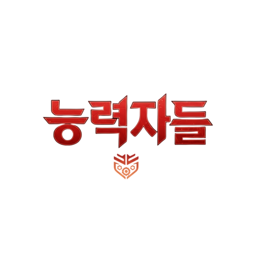

`프로젝트 이름` : **Project RedC 능력자들**  
`프로젝트 전체 파일` : [네이버 MYBOX](https://naver.me/GNRlyRrR)  
`Youtube` : 추후 영상작업 끝나면 추가 예정

### 1.1 프로젝트 목적
`Unreal Engine 5` 기반 멀티플레이어 액션 RPG의 **GAS(Gameplay Ability System) 통합 전투 시스템** 구현  
`Cyphers` 모작 프로젝트

### 1.2 핵심 기술 스택
- **엔진**: Unreal Engine 5.4.4
- **프로그래밍**: C++17
- **네트워킹**: Unreal Replication System
- **애니메이션**: Animation Notify System(판정) + Motion Warping(스킬 이동거리)
- **게임플레이**: Gameplay Ability System (GAS)

### 1.3 주요 특징
- **컴포넌트 기반 아키텍처**: 모듈화된 전투 시스템
- **네트워크 동기화**: 클라이언트-서버 RPC 패턴
- **이벤트 주도 설계**: GAS Event System 및 AnimNotify 활용
- **성능 최적화**: ASC 캐싱, 조건부 틱 활성화

### 1.4 프로젝트 로드맵
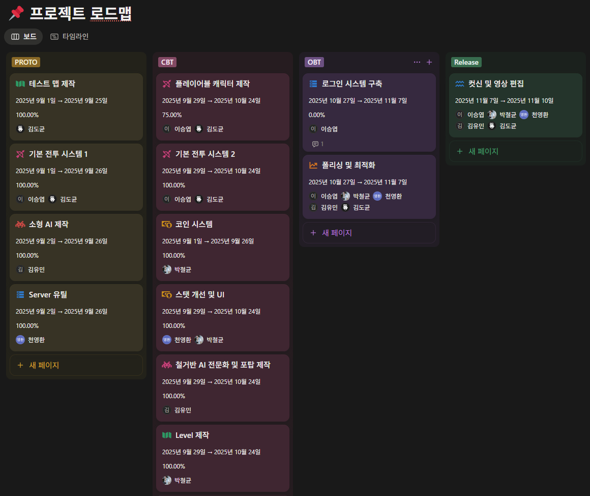
- **총 개발 인력** : 5명
- **총 개발 시간** : 2025년 9월 1일 ~ 2025년 11월 10일

---

## 2. 시스템 플로우차트

### 2.1 전체 게임 플로우
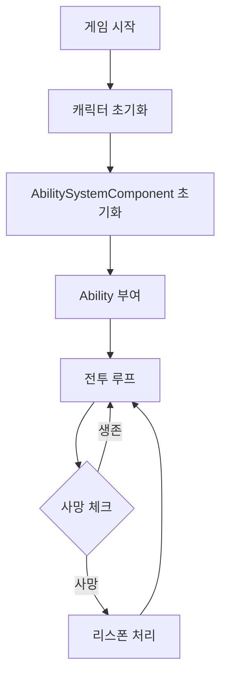

### 2.2 전투 시스템 메인 플로우
```mermaid
flowchart LR
    Input[플레이어 입력] --> Ability[GameplayAbility 활성화]
    Ability --> Montage[AnimMontage 재생]
    Montage --> Notify{AnimNotify 트리거}
    Notify -->|근거리| MeleeHit[ANS_MeleeAttackHitScan]
    Notify -->|원거리| ProjectileSpawn[AN_ProjectileSpawnEvent]
    MeleeHit --> HitDetection[히트 감지]
    ProjectileSpawn --> ProjectileEvent[Projectile 생성 이벤트]
    ProjectileEvent --> ProjectileSpawn2[Projectile Actor 스폰]
    ProjectileSpawn2 --> Collision[충돌 감지]
    HitDetection --> ProcessHit[히트 처리]
    Collision --> ProcessHit
    ProcessHit --> RPC[ServerReceiveHitReactData]
    RPC --> ApplyDamage[데미지 적용]
    ApplyDamage --> HitReact[히트 리액션 애니메이션]
```

### 2.3 데미지 처리 상세 플로우
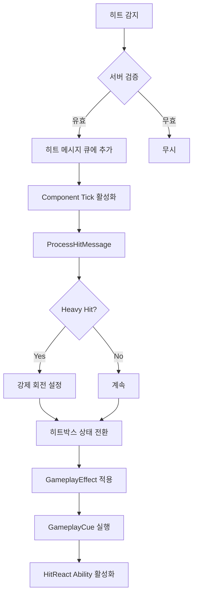

---

## 3. 핵심 아키텍처 분석

### 3.1 CombatComponent 상세 구조

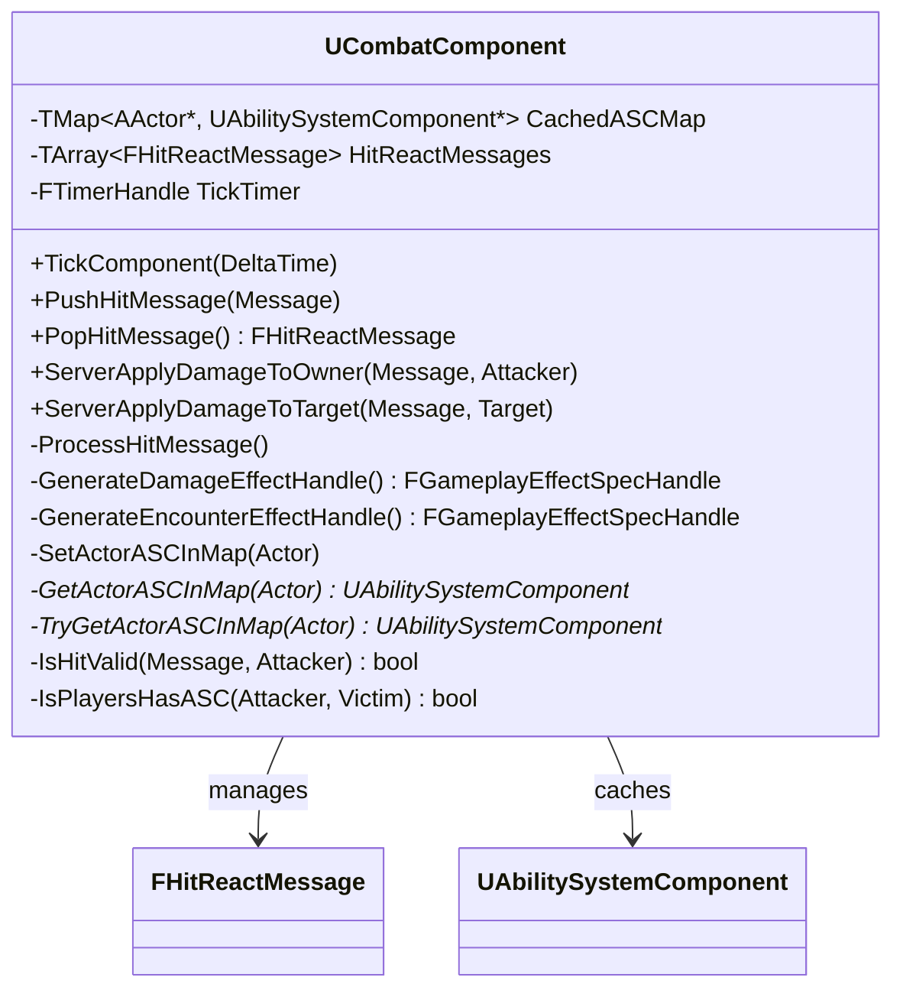

#### 3.1.1 주요 아키텍처

**1) ASC 캐싱 시스템 (Cache Pattern)**
```cpp
TMap<TObjectPtr<AActor>, TObjectPtr<UAbilitySystemComponent>> CachedASCMap;
```
- **목적**: GetAbilitySystemComponent() 호출 비용 최소화
- **전략**: 첫 접근 시 캐싱, 이후 O(1) 조회
- **구현**: `TryGetActorASCInMap`으로 Lazy Initialization

**2) 조건부 틱 활성화 (Performance Optimization)**
```cpp
void UCombatComponent::TickComponent(float DeltaTime, ...)
{
    if (HitReactMessages.Num() > 0) {
        ProcessHitMessage();
    } else {
        SetComponentTickEnabled(false);  // 메시지 없으면 틱 비활성화
    }
}
```
- **이유**: 전투가 없을 때 불필요한 틱 방지
- **효과**: CPU 사용량 감소, 프레임레이트 향상

**3) 서버 검증 레이어 (Anti-Cheat)**
```cpp
bool UCombatComponent::IsHitValid(const FHitReactMessage& Message, const AActor* Attacker) const
{
    float ValidationDistance = FVector::Dist(GetOwner()->GetActorLocation(), Attacker->GetActorLocation());
    return ValidationDistance <= Message.MaximumAttackLength;
}
```
- **목적**: 클라이언트 조작 방지
- **검증**: 공격 사거리 + 20% 여유값 허용

**4) 팩토리 패턴 (Effect Creation)**
- `GenerateDamageEffectHandle()`: 데미지 효과 생성
- `GenerateEncounterEffectHandle()`: 전투 상태 효과 생성
- **장점**: 중복 코드 제거, 일관된 Effect 생성

### 3.2 RedCCharacter 상세 구조

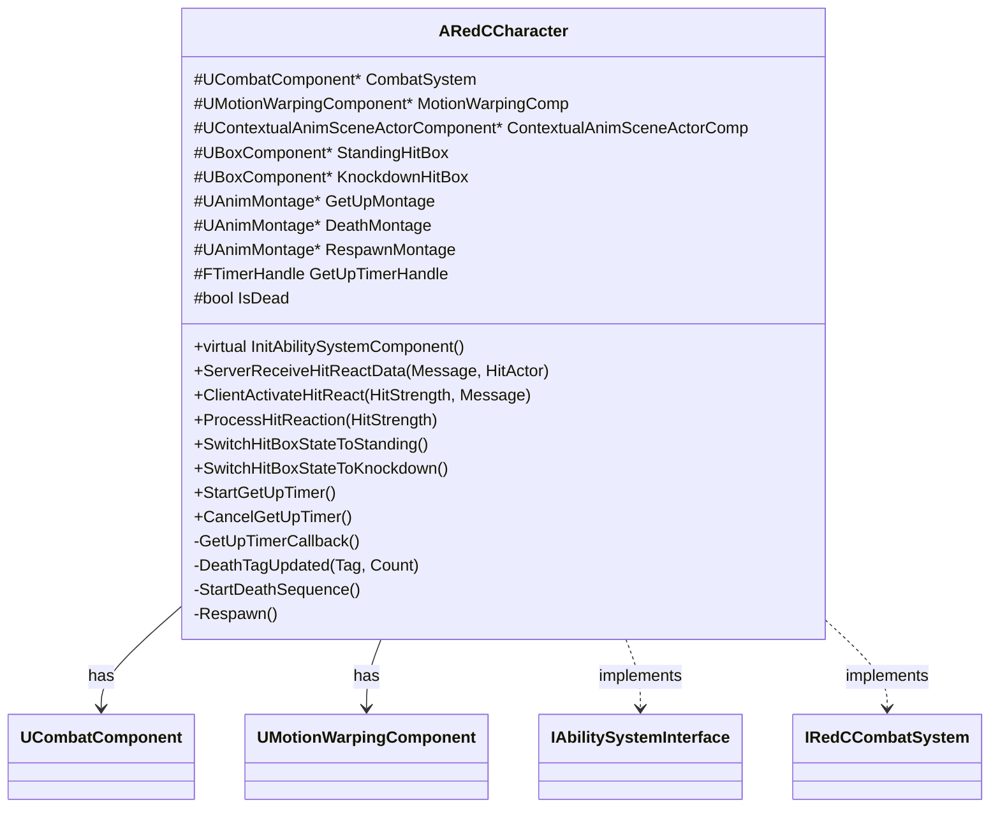

#### 3.2.1 핵심 설계

**1) 상태 머신 기반 히트박스 관리**
```cpp
void ARedCCharacter::SwitchHitBoxStateToKnockdown_Implementation()
{
    StandingHitBox->SetCollisionEnabled(ECollisionEnabled::NoCollision);
    KnockdownHitBox->SetCollisionEnabled(ECollisionEnabled::QueryOnly);
    GetCapsuleComponent()->SetCollisionProfileName(TEXT("PlayerKnockDownProfile"));
}
```
- **2개의 히트박스**: Standing(서 있을 때), Knockdown(넘어졌을 때)
- **상태 전환**: NetMulticast RPC로 모든 클라이언트 동기화
- **이유**:  
  1) 넘어진 상태에서 다른 판정 영역 적용
  2) 모든 클라이언트에 동일한 Collision 영역 동작 보장  
  
**2) 타이머 기반 자동 복구 시스템**  
  

```cpp
void ARedCCharacter::StartGetUpTimer()
{
    GetUpStartTime = GetWorld()->GetTimeSeconds();
    RemainTime = GetUpTimerDuration;  // 3.5초
    GetWorld()->GetTimerManager().SetTimer(
        GetUpTimerHandle,
        this,
        &ARedCCharacter::GetUpTimerCallback,
        0.1f,  // 100ms마다 체크
        true
    );
}
```
- **목적**: 넉다운 후 자동으로 일어나기
- **조건**: 땅에 닿아있을 때만 타이머 진행
- **취소**: 추가 공격 받으면 타이머 리셋

**3) 네트워크 복제 최적화**
```cpp
DOREPLIFETIME_CONDITION_NOTIFY(ARedCCharacter, IsDead, COND_None, REPNOTIFY_OnChanged);
```
- **OnChanged**: 값이 변경될 때만 복제
- **OnRep_Dead()**: 사망/리스폰 애니메이션 동기화

---

## 4. 전투 시스템 상세 설명

### 4.1 근거리 공격 시스템

#### 4.1.1 ANS_MeleeAttackHitScan 구조
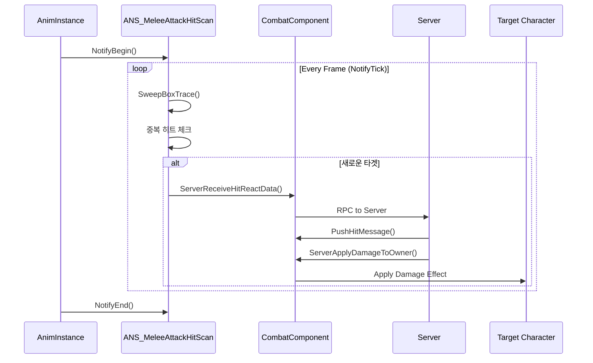

#### 4.1.2 역할 기반 실행 제어
```cpp
if (MeshComp->GetOwner<ARedCAICharacter>()) {
    if (MeshComp->GetOwnerRole() != ROLE_Authority) return;  // AI는 서버에서만
}
else if (MeshComp->GetOwner<ARedCHeroCharacter>()) {
    if (MeshComp->GetOwnerRole() != ROLE_AutonomousProxy) return;  // Player는 로컬에서만
}
```
- **AI**: 서버에서만 히트 검출 (Authority)
- **Player**: 자신의 클라이언트에서만 검출 (AutonomousProxy)
- **이유**: 네트워크 트래픽 최소화, 지연시간 감소
- **클라이언트에서 검출하는 이유**: 서버에서는 랜더링이 이뤄지지 않아 실제로 애니메이션 동작에 따른 Skeletal Mesh의 Socket의 위치가 변하지 않음. 고로, 클라이언트에서 검출 후 서버에서 검증

#### 4.1.3 중복 타격 방지
```cpp
TArray<TWeakObjectPtr<AActor>> HitActors;  // NotifyState 수명 동안 유지

const bool bAlreadyHit = HitActors.ContainsByPredicate([HitActor](const TWeakObjectPtr<AActor>& WeakActor)
{
    return WeakActor.IsValid() && WeakActor.Get() == HitActor;    
});
```
- **WeakObjectPtr**: Actor 삭제되어도 크래시 방지
- **NotifyState 종료 시**: HitActors 자동 초기화

### 4.2 원거리 공격 시스템

#### 4.2.2 AN_ProjectileSpawnEvent 플로우
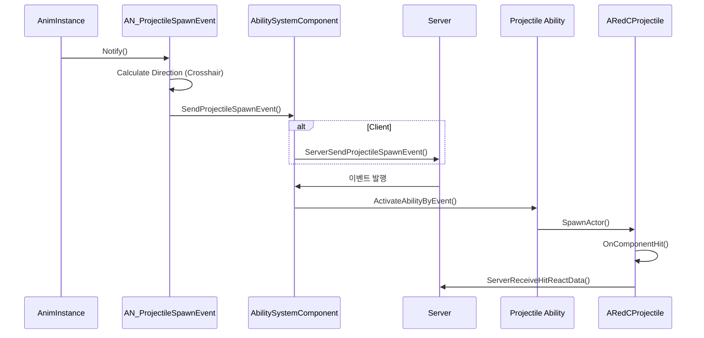

#### 4.2.2 크로스헤어 기반 방향 계산

```cpp
const FVector Direction = CrosshairComponent 
    ? CrosshairComponent->GetCrosshairDirection(SpawnLocation, Distance) 
    : Actor->GetActorForwardVector();
```
- **플레이어**: 크로스헤어 조준점 사용 (정확한 타겟팅)
- **AI**: Actor Forward Vector 사용

#### 4.2.3 이벤트 주도 아키텍처
```cpp
void URedCAbilitySystemComponent::SendProjectileSpawnEvent(const FGameplayTag EventTag, const FRedCProjectileInfo& ProjectileInfo)
{
    if (!GetAvatarActor()->HasAuthority()) {
        ServerSendProjectileSpawnEvent(EventTag, ProjectileInfo);  // Client -> Server RPC
        return;
    }
    
    // Server에서만 실행
    UProjectileSpawnEventObject* EventObject = NewObject<UProjectileSpawnEventObject>();
    EventObject->ProjectileInfo = ProjectileInfo;
    
    FGameplayEventData Payload;
    Payload.OptionalObject = EventObject;
    
    UAbilitySystemBlueprintLibrary::SendGameplayEventToActor(GetAvatarActor(), EventTag, Payload);
}
```
- **분리**: AnimNotify는 이벤트만 발행, 실제 스폰은 Ability가 처리
- **장점**: 네트워크 로직과 게임플레이 로직 분리

### 4.3 히트 리액션 시스템

#### 4.3.1 히트 강도별 처리
```cpp
void UCombatComponent::ProcessHitMessage()
{
    FGameplayTag HitStrengthTag = HitReactMessages[0].HitStrengthTag;
    if (HitStrengthTag.MatchesTag(SharedTags::Event_Shared_HitReact_Heavy)) {
        // Heavy Hit: 강제 회전 + 넉다운
        FRotator Rotation = HitReactMessages[0].AttackDirection.Rotation() + FRotator(0, 180, 0);
        Character->ForceSetCharacterRotation(Rotation);
        Character->SwitchHitBoxStateToKnockdown();
    }
    // Light Hit은 간단한 경직만
    Character->ProcessHitReaction(HitStrengthTag);
}
```

#### 4.3.2 히트 메시지 큐 시스템
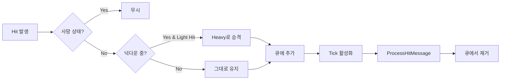

### 4.4 데미지 계산 및 적용

#### 4.4.1 GameplayEffect를 통한 데미지 적용
```cpp
FGameplayEffectSpecHandle UCombatComponent::GenerateDamageEffectHandle(...)
{
    FGameplayEffectSpecHandle SpecHandle = VictimASC->MakeOutgoingSpec(
        UApplyDamageEffect::StaticClass(),
        1.0f,
        DamageEffectContext
    );
    
    // SetByCaller를 통한 동적 값 설정
    SpecHandle.Data->SetSetByCallerMagnitude(DataTags::Data_SetByCaller_SkillPower, Message.DamageAmount);
    SpecHandle.Data->SetSetByCallerMagnitude(DataTags::Data_SetByCaller_SkillMultiplier, Message.DamageMultiplier);
    
    return SpecHandle;
}
```
- **SetByCaller 패턴**: 런타임에 Effect 값 설정
- **장점**: Effect 클래스 재사용성 증가

#### 4.4.2 GameplayCue 실행
```cpp
// 히트 사운드/파티클
FGameplayCueParameters CueParameters;
CueParameters.EffectContext = EffectContextHandle;
OwnerASC->ExecuteGameplayCue(FGameplayTag::RequestGameplayTag("GameplayCue.Shared.HitReact"), CueParameters);

// 카메라 쉐이크
CueParams.NormalizedMagnitude = Message.HitStrengthTag.MatchesTag(SharedTags::Event_Shared_HitReact_Heavy) ? 0.7f : 0.5f;
OwnerASC->ExecuteGameplayCue(GameplayCueTags::GameplayCue_Shared_CameraShake, CueParams);
```

---

## 5. 디자인 패턴 및 구현 전략

### 5.1 적용된 디자인 패턴

#### 5.1.1 Command Pattern (GameplayAbility)
```cpp
class URedCGameplayAbility : public UGameplayAbility {
    virtual void ActivateAbility(...) override;  // Execute
    virtual void EndAbility(...) override;       // Undo
};
```
- **캡슐화**: 각 스킬을 독립적인 Ability 클래스로 구현
- **실행 취소**: EndAbility로 정리 작업

#### 5.1.2 Observer Pattern (Delegate System)
```cpp
// Health 변화 감지
GetGameplayAttributeValueChangeDelegate(URedCHealthSet::GetHealthAttribute())
    .AddUObject(this, &URedCAbilitySystemComponent::OnHealthChanged);

// 사망 태그 감지
ASC->RegisterGameplayTagEvent(PlayerStateTags::Player_State_Death)
    .AddUObject(this, &ARedCCharacter::DeathTagUpdated);
```
- **느슨한 결합**: ASC와 캐릭터 로직 분리
- **이벤트 주도**: 상태 변화에 자동 반응

#### 5.1.3 Factory Pattern (Effect Creation)
```cpp
FGameplayEffectSpecHandle GenerateDamageEffectHandle(...);
FGameplayEffectSpecHandle GenerateEncounterEffectHandle(...);
```
- **일관성**: 동일한 방식으로 Effect 생성
- **확장성**: 새로운 Effect 타입 추가 용이

#### 5.1.4 Component Pattern
```cpp
ARedCCharacter {
    UCombatComponent* CombatSystem;           // 전투 로직
    UMotionWarpingComponent* MotionWarpingComp;  // 모션 워핑
    UCrosshairComponent* CrosshairComponent;   // 조준
}
```
- **모듈화**: 기능별 컴포넌트 분리
- **재사용**: 다른 캐릭터 타입에서도 동일 컴포넌트 사용

### 5.2 네트워크 아키텍처

#### 5.2.1 RPC 전략
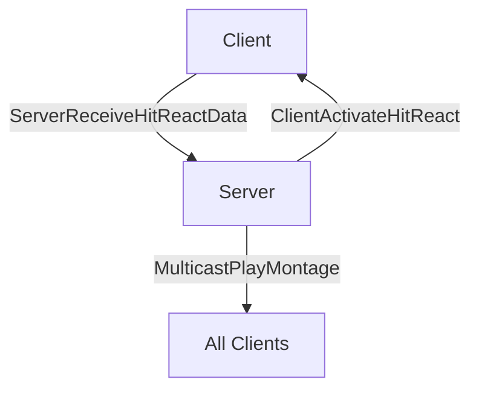

**RPC 타입별 사용 용도:**
- **Server RPC**: 히트 데이터 전송, 데미지 적용 요청
- **Client RPC**: 특정 플레이어에게 UI 업데이트
- **Multicast RPC**: 모든 클라이언트에 애니메이션 동기화

#### 5.2.2 Authority 체크 패턴
```cpp
if (GetOwner()->HasAuthority()) {
    // 서버에서만 실행되는 로직
    ApplyGameplayEffect(...);
}

if (GetLocalRole() == ROLE_AutonomousProxy) {
    // 로컬 플레이어에서만 실행
    PerformTrace(...);
}
```

### 5.3 성능 최적화 전략

#### 5.3.1 메모리 최적화
- **WeakObjectPtr**: Actor 참조 시 메모리 누수 방지
- **ASC 캐싱**: 반복적인 GetComponent 호출 제거
- **조건부 틱**: 필요할 때만 Component Tick 활성화

#### 5.3.2 네트워크 최적화
- **역할 기반 실행**: AI는 서버, Player는 클라이언트에서 trace
- **RPC 최소화**: 필요한 데이터만 전송
- **COND_None vs COND_OwnerOnly**: 복제 조건 세밀하게 설정

#### 5.3.3 계산 최적화
```cpp
// 사거리 검증: 제곱근 계산 회피
float DistSquared = FVector::DistSquared(A, B);
if (DistSquared > MaxRangeSquared) { /* 너무 멀음 */ }
```

---

## 6. 기술 부채 및 개선 방향

### 6.1 현재 제한사항
- **히트박스 정확도**: Box Collision 사용 (Capsule/Sphere 고려)
- ~~**컨테이너 변경**: 현재 배열(TArray)로 관리, 최적화 필요~~ 해결 완료, TQueue로 전환
- **리플레이 시스템**: 미구현

### 6.2 향후 개선 계획
- **Animation Budget Allocator** 통합
- **Predictive Hit Detection** 구현 (지연 보상)
- **Buff/Debuff** Effect 확장
- **좌표지정 공격 능력** 구현

---

## 7. 결론

본 프로젝트는 **GAS의 강력함**과 **컴포넌트 기반 설계의 유연성**을 결합하여, 확장 가능하고 유지보수가 용이한 전투 시스템을 구축하였습니다.

### 7.1 핵심 성과
- **모듈화**: 각 기능이 독립적인 컴포넌트로 분리
- **네트워크 안정성**: 서버 검증 레이어 구축
- **성능**: 조건부 틱, ASC 캐싱으로 최적화
- **확장성**: 새로운 스킬/리액션 추가 용이

### 7.2 학습 포인트
본 프로젝트를 통해 다음과 같은 핵심 개념을 습득할 수 있습니다:

1. **GAS 통합**: AnimNotify와 GameplayAbility의 유기적 연결
2. **네트워크 프로그래밍**: Authority/Role 기반 실행 분기
3. **성능 최적화**: 캐싱, 조건부 틱, RPC 최소화
4. **디자인 패턴**: Command, Observer, Factory 패턴 실전 적용
5. **아키텍처 설계**: 모듈화, 확장성, 유지보수성을 고려한 시스템 구축

---

**개발 환경**: Unreal Engine 5.4.4 | C++17 | Visual Studio 2022  
**최종 업데이트**: 2025.11.28
